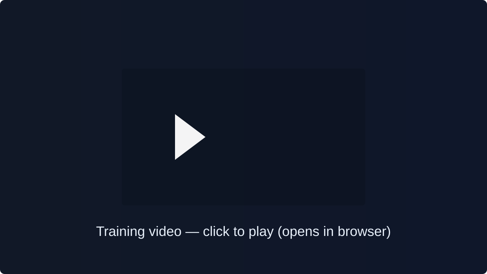

# Flappy Bird Reinforcement Learning Platform

A modular, clean-architecture Reinforcement Learning (RL) platform built in Python using **Pygame**, **NumPy**, **PyTorch**, and **Matplotlib**.

This project trains an AI agent to master the game of **Flappy Bird** with pipes of dynamic, varied heights.

[](assets/Flappy%20Bird%20RL.mp4)

<!--
Clicking the thumbnail opens the raw MP4 in the browser where audio will play.
GitHub strips the <video> tag from README; this thumbnail links to the file instead.
-->

It provides two algorithms:
1. **Tabular Q-Learning** (using discretized continuous state space)
2. **Deep Q-Learning / DQN** (using PyTorch Multi-Layer Perceptrons with Replay Memory and Target Networks)

It features an **interactive Pygame split-screen interface** that renders live gameplay side-by-side with a real-time training analytics dashboard, as well as a **headless comparison script** to benchmark Q-Learning vs DQN performance head-to-head.

---

## Architecture & Codebase Structure

The codebase is built following **Clean Architecture** and **SOLID Principles**, ensuring complete decoupling between game physics, domain entities, RL agent logic, and presentation rendering.

```
Flappy_Bird_RL/
├── env/                            # Local Virtual Environment
├── models/                         # Persistent Checkpoints (q_table.pkl, dqn_model.pth)
├── logs/                           # Exported CSV metrics and comparison plots
├── requirements.txt                # Project dependencies specification
├── README.md                       # Comprehensive User Guide
├── compare.py                      # Head-to-head benchmark runner
├── evaluate_metrics.py             # RL evaluation report generator (8 metrics + plot)
├── main.py                         # Application launcher (GUI & Headless modes)
│
├── evaluation/                     # Standalone Evaluation Layer
│   ├── eval_renderer.py            # Pygame evaluation window with trajectory trails
│   └── evaluator.py                # Greedy policy evaluation runner (GUI / Headless)
│
├── core/                           # Domain Layer (Pure Python, zero framework dependencies)
│   ├── entities/
│   │   ├── bird.py                 # Bird physics entity (gravity, jump, bounds)
│   │   ├── pipe.py                 # Pipe entity (varied height gap, collision rects)
│   │   └── game_state.py           # Immutable snapshot of frame state
│   └── interfaces/
│       ├── agent_interface.py      # Abstract Agent interface (ISP / DIP)
│       └── environment_interface.py# Abstract Environment contract
│
├── environment/                    # Game Physics & Environment Layer
│   ├── flappy_env.py               # FlappyBirdEnv implementation
│   └── reward_system.py            # Reward & Penalty calculation logic
│
├── agents/                         # RL Algorithm Implementations
│   ├── q_learning/
│   │   ├── q_agent.py              # Tabular Q-Learning agent
│   │   └── discretizer.py          # State discretizer (continuous → discrete tuple)
│   └── dqn/
│       ├── dqn_agent.py            # Deep Q-Network agent (PyTorch)
│       ├── network.py              # PyTorch MLP QNetwork architecture
│       └── replay_buffer.py        # Experience Replay Memory
│
├── training/                       # Application & Workflow Layer
│   ├── trainer.py                  # Training orchestrator & GUI event loop
│   └── metrics_logger.py           # Episode performance logger & CSV exporter
│
├── ui/                             # Presentation Layer (Pygame)
│   ├── renderer.py                 # Pygame renderer for bird, pipes, and HUD
│   └── dashboard.py                # Live Matplotlib charts surface renderer
│
└── utils/                          # Cross-cutting Utilities
    ├── config.py                   # Centralized hyperparameters & physics constants
    └── persistence.py              # Model save & load manager
```

---

## How It Works

### 1. Game Environment & Varied Height Obstacles
- The game viewport runs at 400×600 pixels.
- The bird is acted upon by gravity (`+0.8 px/frame²`) and jumps (`-9.0 px/frame`).
- Obstacles are generated as pairs of top and bottom pipes. Each pipe pair generates a gap of 140px height centered at a **random Y position** (`between Y=100 and Y=380`), providing randomized, dynamic difficulty.

### 2. Reward & Penalty Shaping Mechanism
To guide the agent across pipes, the reward function delivers shaped feedback at each timestep:
- **Survival Reward**: `+0.1` for remaining alive each frame.
- **Pipe Clearance Bonus**: `+10.0` when successfully flying past a pipe pair.
- **Crash Penalty**: `-500.0` when colliding with top ceiling, ground, or pipes.
- **Gap Alignment Shaping**: Up to `+0.5` proportional bonus for keeping the bird vertically centered with the upcoming pipe gap.

### 3. Terminal Progress Logging
In addition to live visual charts, real-time training progress is logged directly to the terminal after every episode/epoch:
```bash
[Q-Learning Ep 0042/1000] Score:  3 | Reward:   -468.2 | Crash Penalty: -500.0 | Steps:  142 | Epsilon: 0.843 | Best:  5 | Q-Table Size: 1250
[DQN Ep 0042/1000]        Score:  4 | Reward:   -455.1 | Crash Penalty: -500.0 | Steps:  180 | Epsilon: 0.843 | Best:  6 | Avg Loss: 4.8210
```

### 3. Persistent Memory Across Game Overs
- When the bird crashes, **the episode ends and the score resets to 0**, but the agent's memory (**Q-table entries / Neural Network weights and exploration rate `epsilon`**) **does NOT reset**.
- The agent retains all learned experience across thousands of episodes.

### 4. Q-Learning vs Deep Q-Learning (DQN)

| Feature | Tabular Q-Learning | Deep Q-Learning (DQN) |
|---|---|---|
| **State Input** | Discretized state tuple `(y_bin, x_bin, v_bin)` | Raw 4D continuous vector `[y_diff, x_diff, velocity, subsequent_y_diff]` |
| **State Space** | ~960 discrete bins | Continuous 4-dimensional vector space |
| **Model Storage** | Dictionary mapping `(state, action) → Q-value` | PyTorch 3-Layer MLP (`4 -> 64 -> 64 -> 2`) |
| **Update Method** | Bellman TD Update `Q(s,a) += α * (r + γ max Q(s',a') - Q(s,a))` | Huber Loss backprop via Adam Optimizer with Replay Buffer & Target Network |
| **Persistence** | `models/q_table.pkl` | `models/dqn_model.pth` |

---

## Installation & Setup Guide

### Prerequisites
- **Python 3.10** or higher
- Git (optional)

### Step-by-Step Installation

1. **Clone or Open the Repository**:
   ```powershell
   cd "path/to/Flappy_Bird_RL"
   ```

2. **Create Virtual Environment**:
   Create a local virtual environment (named `env`) with system package inheritance:
   ```powershell
   python -m venv --system-site-packages env
   ```

3. **Activate Virtual Environment** (Optional):
   - PowerShell: `.\env\Scripts\Activate.ps1`
   - Command Prompt: `.\env\Scripts\activate.bat`

4. **Install Dependencies**:
   Install required packages via `requirements.txt`:
   ```powershell
   env\Scripts\python.exe -m pip install -r requirements.txt
   ```

   *Packages installed:* `pygame`, `torch`, `numpy`, `matplotlib`.

---

## How to Run

### 1. Interactive GUI Mode (Q-Learning)
Launch the interactive Pygame window with live gameplay on the left and dynamic graphs on the right:
```powershell
env\Scripts\python.exe main.py --mode qlearning
```

### 2. Interactive GUI Mode (Deep Q-Learning / DQN)
Train the PyTorch Deep Q-Network agent in the visual interface:
```powershell
env\Scripts\python.exe main.py --mode dqn
```

#### GUI Interactive Controls:
- **`[SPACE]`**: Toggle **Speed Boost** (runs fast-forward training without FPS limits).
- **`[P]`**: **Pause / Resume** training.
- **`[S]`**: **Manually save** model checkpoint to disk.

### 3. Headless Training Mode
Run training rapidly without opening a visual window:
```powershell
env\Scripts\python.exe main.py --mode qlearning --episodes 500 --headless
```

### 4. Head-to-Head Algorithm Comparison
Run a side-by-side benchmark comparing Q-Learning vs DQN for N episodes:
```powershell
env\Scripts\python.exe compare.py --episodes 200
```
*Outputs generated:*
- `logs/q_learning_metrics.csv`: CSV log of Q-Learning training metrics.
- `logs/dqn_metrics.csv`: CSV log of DQN training metrics.
- `logs/q_vs_dqn_comparison.png`: Side-by-side comparative plots (Scores & Cumulative Rewards).

### 5. Standalone Model Evaluation & RL Metrics Report
Evaluate your trained model checkpoints using pure greedy policies (no exploration) to see how they perform under standard RL evaluation metrics:
```powershell
env\Scripts\python.exe evaluate_metrics.py --episodes 100
```
Parameters (Optional):
- `--episodes <N>`: Set number of evaluation episodes (default: 100).
- `--gamma <F>`: Discount factor for discounted reward metrics (default: 0.99).
- `--threshold <N>`: Rolling mean score threshold for convergence (default: 5).
- `--seed <N>`: Random seed for reproducible pipe heights and positioning.
- `--q-model <Path>`: Path to a custom Q-Learning `.pkl` file.
- `--dqn-model <Path>`: Path to a custom DQN `.pth` file.

*Outputs generated:*
- `logs/rl_evaluation_report.png`: High-fidelity, 8-panel visualization dashboard summarizing all evaluation metrics.

---

## Model Evaluation & Performance Metrics

The evaluation module (`evaluate_metrics.py`) provides an extensive analysis framework based on industry-standard RL evaluation patterns:

### 1. The Eight Metrics Tracked
1. **Cumulative Reward**: Focuses on long-term reward accumulation across evaluation episodes, indicating the general learning trajectory stability.
2. **Average Reward per Step (Reward Efficiency)**: Computes the step-level reward rate ($R / \text{steps}$), evaluating the density and quality of decisions.
3. **Discounted Reward**: Computes the discounted return ($\sum \gamma^t r_t$) to evaluate how value decays over long-term steps.
4. **Convergence Rate**: Tracks how many episodes are required for a moving average score to permanently cross a predefined threshold.
5. **Score Distribution**: A violin plot of game scores, displaying the distribution, density, mean, and spread of the agent's performance.
6. **Stability (Volatility)**: Tracks rolling standard deviation of scores across a moving window, identifying high-volatility or unstable behaviors.
7. **Sample Efficiency**: Records the cumulative environment steps required to reach key scoring thresholds (e.g., Score $\ge$ 1, 5, 10, 20, 30, 50).
8. **Summary Statistics**: A unified grid showing mean score, standard deviation, max score, medians, percentiles, average steps, and cumulative steps.

### 2. Performance Outcome After 100,000 Episodes
1. **Q-Learning proved to be the best performer**, reaching a **best score of 217+** in the performance evaluation after training for 100,000 episodes.
2. **DQN failed to match this performance**, reaching only a **best score of 5** after training for 100,000 episodes.
3. This outcome highlights that, in this environment and training setup, the discretized tabular Q-Learning approach was substantially more effective than the deep Q-network under the same long-training regime.

## Troubleshooting & Tips

- **Windows Path Limits**: If installing PyTorch in an isolated venv encounters path length errors (`WinError 206`), create the virtual environment using `--system-site-packages` as shown in the installation guide.
- **Resuming Training**: The trainer automatically detects existing checkpoints in `models/` and resumes learning seamlessly.
